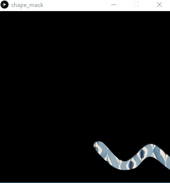
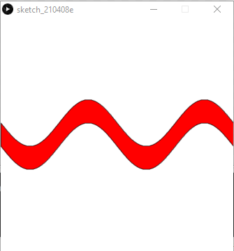

# processing-snippets

[Shape_mask](shape_mask/) 
Create a new layer with custom shapes and use this layer as a mask for an image. In this example the masked shape is following the mouse position. 

[Sine_shape](sine_shape/) 
An almost perfect sine (closed) shape 

